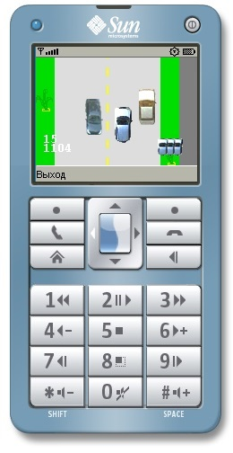
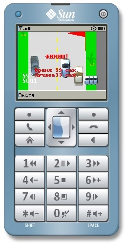

# Мобильная игра Driver на J2ME

Игра для мобильных телефонов на платформе Java ME :iphone:
  
Игрок должен доехать до финиша, обгоняя попутные машины и не столкнувшись со встречными.  
У игрока три жизни. Лучший результат сохраняется в истории.  
В игре звуковое сопровождение :speaker:    

Проект 2007 года :calendar: 

Написана на языке Java

Статус проекта: Завершен.

Copyright (c) 2007 Evgeny Goryachev  
Gor.Com 